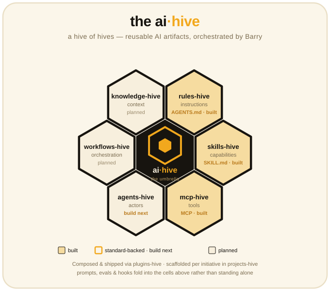

<p align="center">
  
</p>

# ai-hive

> **The House of Hives.** A family of portable, versioned repositories for
> [werkrbee](https://github.com/werkrbee)'s reusable AI artifacts — each built on
> an open standard, harness-agnostic, and installable across every major agent
> harness. Barry, the chief-of-staff orchestrator, is the king at the center.

`ai-hive` is the **umbrella index**. It doesn't hold artifacts itself; it points
to the individual hives, explains how they fit together, and defines the shared
conventions every hive follows. Think of it as the entry hall of the House of
Agents — each room (hive) furnishes one layer of an agent system.

## The layered model

An agent system is a stack of reusable artifacts. Each layer has exactly one
portable artifact worth versioning — and that's what earns a hive:

| Layer | Hive | Artifact / standard | Status |
|-------|------|---------------------|--------|
| Context | `knowledge-hive` | docs, memory, RAG corpora | planned |
| Instructions | `rules-hive` | `AGENTS.md`, `CLAUDE.md` | **build next** |
| Capabilities | [`skills-hive`](https://github.com/werkrbee/skills-hive) | `SKILL.md` | ✅ **built** |
| Tools | `mcp-hive` | MCP server configs | **build next** |
| Actors | `agents-hive` | subagent / persona defs | planned |
| Orchestration | `workflows-hive` | recipes / pipelines | planned |

**Composition & delivery** (not layers, but how the above ship together):

| Role | Hive | Purpose |
|------|------|---------|
| Bundles | `plugins-hive` | package skills + rules + tools + agents into installable packs |
| Containers | `projects-hive` | scaffolds & workspace templates that assemble hives per initiative |

Prompts, evals, and hooks intentionally **fold into the cells above** rather than
standing alone — prompts live inside skills, evals ship beside the skill/agent
they test, and hooks are per-harness config.

## Why a hive earns its own repo

A category becomes a hive only when its artifact passes two tests:

1. **Portable** — reusable across projects *and* across harnesses, not tied to one tool.
2. **Standard-backed** — there's an open convention (`SKILL.md`, `AGENTS.md`, MCP)
   so the collection doesn't fragment.

That's why `skills-hive`, `rules-hive`, and `mcp-hive` are clear yeses — each has
a real standard. Categories without one (models, datasets, raw prompts) are better
as config *inside* projects than as standalone repos.

## The hives

### 🐝 skills-hive — *capabilities* ✅

Portable `SKILL.md` skills, installable into every major harness. Home of
**Barry**, the chief-of-staff orchestrator, and the two-axis pattern the other
hives copy.
→ [github.com/werkrbee/skills-hive](https://github.com/werkrbee/skills-hive)

### rules-hive — *instructions* (build next)

Always-on guardrails as portable `AGENTS.md` / `CLAUDE.md` files. The most
portable sibling to skills, since `AGENTS.md` is a cross-harness standard.

### mcp-hive — *tools* (build next)

A registry of MCP server configs — where agents actually act. Highest-leverage
hive: skills without tools are just instructions.

### agents-hive — *actors*

Subagent and persona definitions — literally Barry's fleet as durable artifacts.
Conceptually core, but agent formats vary by harness, so expect per-harness
adapters (as in skills-hive).

### workflows-hive — *orchestration*

Stored multi-step recipes and pipelines. Barry is the runtime version of this;
`workflows-hive` is the saved version.

### knowledge-hive — *context*

Docs, memory files, and RAG corpora — what the fleet knows. Weak cross-harness
standard today, so this may live inside projects until one emerges.

### plugins-hive & projects-hive — *composition*

`plugins-hive` bundles the others into installable packs; `projects-hive` holds
scaffolds that assemble the right hives for a given initiative.

## Shared conventions

Every hive in the House follows the same pattern (see `skills-hive` for the
reference implementation):

- **Harness-agnostic by design** — artifacts are portable; nothing is locked to one agent.
- **Two axes** — a `<thing>/` tree for *what* the artifact is (portable source of
  truth) and an `adapters/<harness>/` tree for *where* it runs (harness taxonomy
  and overrides). Sub-harnesses nest one level deeper (e.g. Scout under GitHub
  Copilot).
- **Product-name directories** in kebab-case (`claude-code`, `github-copilot`,
  `databricks-genie-code`).
- **Cross-platform install** — a Bash-3.2-safe `install.sh` and a Windows
  `install.ps1` (junctions + settings) fan the artifacts into each harness.
- **Naming** — `<thing>-hive`, all under the `werkrbee` org.

## One-clone setup (optional)

Each hive is its own repo, so you normally install them **independently** — that's
the default and keeps versioning, issues, and installs clean. GitHub repos are
two-level (`owner/repo`), so a hive is never a sub-repo of this one; instead, if
you want to pull the whole House in a single clone, add the hives as **git
submodules** under `hives/`:

```bash
# from the ai-hive repo root — add each hive as it ships
git submodule add https://github.com/werkrbee/skills-hive.git hives/skills-hive
# git submodule add https://github.com/werkrbee/rules-hive.git  hives/rules-hive
# git submodule add https://github.com/werkrbee/mcp-hive.git    hives/mcp-hive
git commit -m "Add hives as submodules"
```

Then anyone can clone everything at once:

```bash
git clone --recurse-submodules https://github.com/werkrbee/ai-hive.git
# or, in an existing clone:
git submodule update --init --recursive
```

Submodules pin each hive at a specific commit; refresh them with
`git submodule update --remote`. This is entirely optional — every hive stays
fully usable on its own, and the umbrella works as a plain index without it.

## Roadmap

1. ✅ **skills-hive** — shipped.
2. **rules-hive** — `AGENTS.md` guardrails (fast, high-portability win).
3. **mcp-hive** — tool/connector registry (highest leverage).
4. **agents-hive** — Barry's fleet as durable artifacts.
5. Then compose everything via **plugins-hive** and scaffold with **projects-hive**.

## License

MIT.
