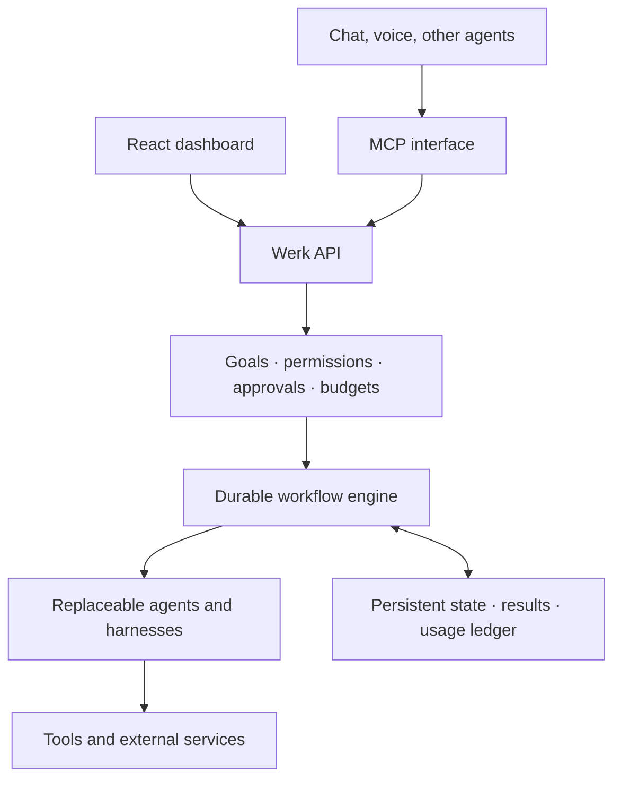

# Interface independence — the durable werkrbee

_Architecture direction: make werkrbee's capabilities independent of any single
interface. A companion to [`factory-thesis.md`](factory-thesis.md) — the factory
produces capabilities; this is how they're delivered and how they endure._

## Thesis

React is one way to use werkrbee, not the product. The enduring product is the **service**
that understands goals, coordinates werk, protects budgets, and delivers results. The
Blockbuster→Netflix question is the right one: *what value remains when the delivery
channel changes?* For werkrbee the answer is **trusted execution under human direction** —
and whether someone reaches it through a dashboard, chat, voice, or another agent should
become interchangeable.

Said plainly: the interface is a client. The service is the asset. Build so the client can
be swapped, added to, or removed without touching what makes werkrbee valuable.

## Target architecture

Every interface enters through the same door (the Werk API), directly or via MCP. Control
and economics live in the core. Execution is durable. Workers are replaceable. State
outlives any single run.

## Five choices that make this practical

### 1. Turn each feature into a callable capability

Creating werk, requesting approval, executing a step, and retrieving results should all
work without opening a browser. Expose the same underlying operations through an **API**
and through **MCP**, so a human at a dashboard and an agent over a protocol drive the
identical primitives. MCP provides a standard interface for agent-accessible tools;
authorization still belongs in the service, never in the model or the caller.

### 2. Give execution a durable lifecycle

A goal should survive a closed tab, a crashed worker, a restart, or a human taking two
days to approve. Persist the plan and checkpoint each step, so progress resumes instead of
restarting. Evaluate Temporal when introducing real multi-step execution — its workflow
history supports recovery after failures. External actions still need their own
idempotency controls, because a resumed workflow must not repeat an effect that already
landed.

### 3. Make agents replaceable workers

Define an assignment by what it needs, not who runs it: required capability, inputs,
expected output, budget, and permissions. Put model- and harness-specific behavior behind
adapters so a worker can be swapped without touching the contract. This is the clean split
between the two projects: **ai-hive supplies the portable instructions and personas**
(Barry, Patricia, the skills and rules), and **werkrbee supplies the execution contract and
operational state**. The hive says how to act; the service decides whether, tracks what
happened, and can replace the actor.

### 4. Enforce human control and token economics outside the model

Barry can propose a plan. The **service** decides whether it is authorized and affordable —
that judgment must not live inside the agent it governs. Approvals bind to a specific
action and scope, not a blanket yes. Reserve budgets before execution, reconcile actual
usage afterward, and track cost per accepted outcome alongside raw token consumption. This
is Patricia's domain made operational: the [Queen Bee's Charter](https://github.com/werkrbee/rules-hive)
sets the law; the service enforces it with real gates and a real ledger.

### 5. Build value that compounds across interfaces

Retain the assets that make the next action better: useful context, proven workflows,
evaluation results, decision history, and integrations — all exportable. These compound
regardless of which interface is in front, and they remain valuable even if users stop
opening the dashboard entirely. Headless architecture alone does not create this
advantage; the accumulated, portable state does. This is the same compounding the factory
thesis describes, held at the level of a running service rather than a repo of artifacts.

## Where werkrbee is today

The current build has a useful starting separation: React calls a local service that owns
approvals and token accounting. That is the right seam. But the service still only
**generates plans** — it lacks durable, autonomous multi-step execution. Nothing yet
survives a restart mid-goal, and there is no second interface exercising the same
operations. This document is direction and a bet, not a description of shipped behavior.

## Recommended next milestone

One real workflow that can be:

- initiated through **either** the dashboard **or** MCP,
- paused for approval,
- survives a service restart,
- finishes safely (idempotent external effects), and
- reports its result and its cost.

Proving that single loop end to end will do more for werkrbee's longevity than any number
of additional dashboard features. It converts the thesis above from an argument into a
fact about the running system.

## Sources

- [Model Context Protocol specification](https://modelcontextprotocol.io/specification/2024-11-05/index)
- [Temporal documentation](https://docs.temporal.io/)
