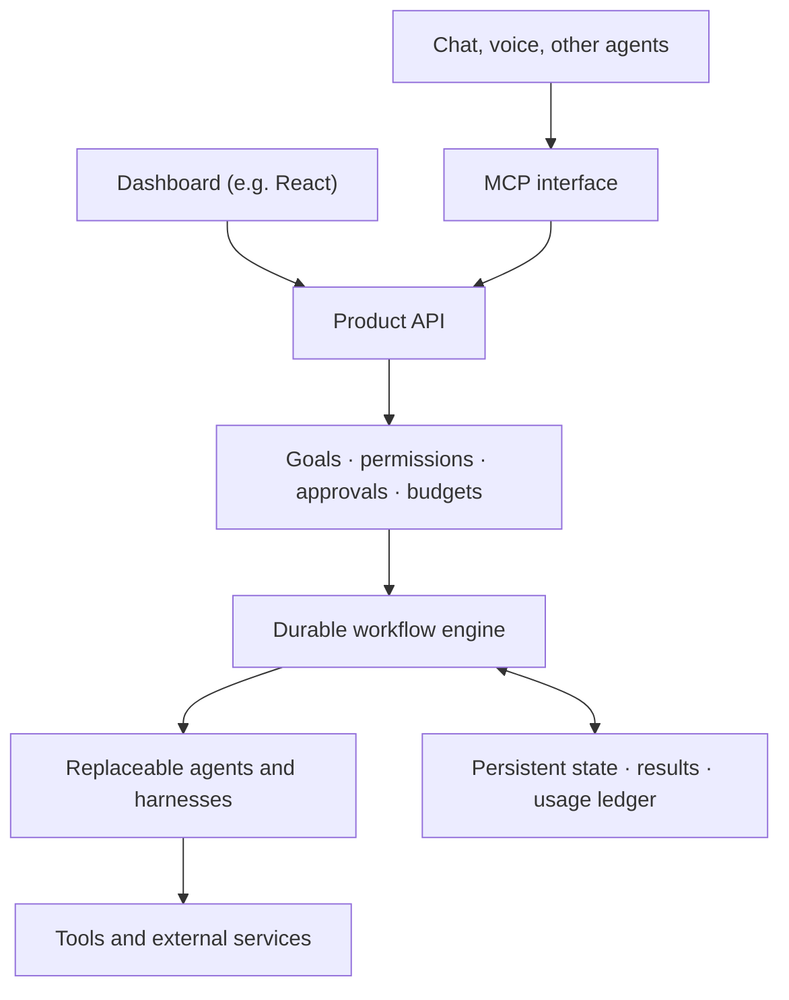

# Interface independence — the durable service

_A House of Hives architecture principle: make a product's capabilities independent of any
single interface. A companion to [`factory-thesis.md`](factory-thesis.md) — the factory
produces capabilities; this is how they're delivered and how they endure. werkrbee/lineup
appears here only as a worked example._

## Thesis

For any product built on the hives, the interface is a client, not the product. A UI — a
React dashboard, say — is one way in. The enduring product is the **service** that
understands goals, coordinates work, protects budgets, and delivers results. The
Blockbuster→Netflix question is the right one to ask of any app: *what value remains when
the delivery channel changes?* The answer that survives is **trusted execution under human
direction** — and whether someone reaches it through a dashboard, chat, voice, or another
agent should become interchangeable.

Build so the client can be swapped, added to, or removed without touching what makes the
product valuable.

## Target architecture

Every interface enters through the same door (the product API), directly or via MCP.
Control and economics live in the core. Execution is durable. Workers are replaceable.
State outlives any single run.

## Five choices that make this practical

### 1. Turn each feature into a callable capability

Whatever the product does — create a unit of work, request an approval, execute a step,
retrieve results — should work without opening a browser. Expose the same underlying
operations through an **API** and through **MCP**, so a human at a dashboard and an agent
over a protocol drive the identical primitives. MCP provides a standard interface for
agent-accessible tools; authorization still belongs in the service, never in the model or
the caller.

### 2. Give execution a durable lifecycle

A goal should survive a closed tab, a crashed worker, a restart, or a human taking two days
to approve. Persist the plan and checkpoint each step, so progress resumes instead of
restarting. Evaluate Temporal when introducing real multi-step execution — its workflow
history supports recovery after failures. External actions still need their own idempotency
controls, because a resumed workflow must not repeat an effect that already landed.

### 3. Make agents replaceable workers

Define an assignment by what it needs, not who runs it: required capability, inputs,
expected output, budget, and permissions. Put model- and harness-specific behavior behind
adapters so a worker can be swapped without touching the contract. This is the clean split
the House of Hives is built around: **ai-hive supplies the portable instructions and
personas** (the skills, rules, and characters), and **the product supplies the execution
contract and operational state**. The hive says how to act; the service decides whether,
tracks what happened, and can replace the actor.

### 4. Enforce human control and token economics outside the model

An agent can propose a plan. The **service** decides whether it is authorized and
affordable — that judgment must not live inside the agent it governs. Approvals bind to a
specific action and scope, not a blanket yes. Reserve budgets before execution, reconcile
actual usage afterward, and track cost per accepted outcome alongside raw token
consumption. This is the governance layer made operational: a ruleset like the
[Queen Bee's Charter](https://github.com/werkrbee/ai-hive/tree/main/hives/rules-hive) sets the law; the service
enforces it with real gates and a real ledger.

### 5. Build value that compounds across interfaces

Retain the assets that make the next action better: useful context, proven workflows,
evaluation results, decision history, and integrations — all exportable. These compound
regardless of which interface is in front, and they remain valuable even if users stop
opening the dashboard entirely. Headless architecture alone does not create this
advantage; the accumulated, portable state does. It is the same compounding the factory
thesis describes, held at the level of a running service rather than a repo of artifacts.

## Reading where a product sits on this path

Use a short litmus test, independent of the app:

- Can every core operation be invoked without the UI (API **and** MCP)?
- Does a goal survive a restart mid-execution?
- Are workers defined by contract, so one can be swapped without a rewrite?
- Do authorization and budget decisions live in the service, not the agent?
- Is the accumulated state exportable and useful to the next action?

A product that answers "yes" to all five is interface-independent. Most start with one or
two and grow into the rest.

## Worked example — werkrbee / lineup

werkrbee is the reference product for this pattern, and `lineup` is the app proving it. Its
current build has a useful starting separation: a React dashboard calls a local service
that owns approvals and token accounting — the right seam. But the service still only
**generates plans**; it lacks durable, autonomous multi-step execution, nothing yet
survives a restart mid-goal, and no second interface exercises the same operations.
(werkrbee's term for a unit of work is "werk"; the principle here is the general one.)

The instructive point: even a young product already benefits from putting control and
accounting in the service rather than the UI — that single decision is what makes every
later interface cheap to add.

## Recommended next milestone (for any product on this path)

One real workflow that can be:

- initiated through **either** the dashboard **or** MCP,
- paused for approval,
- survives a service restart,
- finishes safely (idempotent external effects), and
- reports its result and its cost.

Proving that single loop end to end does more for a product's longevity than any number of
additional UI features. It converts the thesis above from an argument into a fact about the
running system.

## Sources

- [Model Context Protocol specification](https://modelcontextprotocol.io/specification/2026-07-28)
- [Temporal documentation](https://docs.temporal.io/)
