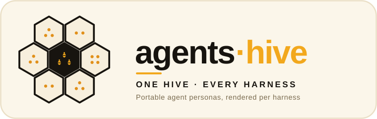

<p align="center">
  
</p>

# agents-hive

> **Harness-agnostic by design.** Agent/subagent personas written once in a
> neutral form and rendered into each harness's native agent format — Claude Code
> subagents, GitHub Copilot chatmodes, the `.agents/` ecosystem, and more.

*Part of the **[ai-hive](https://github.com/werkrbee/ai-hive)** family — werkrbee's House of Hives (skills · rules · tools · agents · and more).*

The **actors** layer of the House of Hives — *who* does the work. These are the
durable versions of the fleet **Barry** dispatches (see his
[`fleet.md`](https://github.com/werkrbee/ai-hive/blob/main/hives/skills-hive/skills/barry/references/fleet.md))
and the review agents **Patricia** relies on. Each persona is stored once and
rendered per harness, because agent formats aren't yet a single standard.

## Agents

| Agent | Role | For |
|-------|------|-----|
| [**explore**](agents/explore/agent.md) | Read-only codebase discovery | mapping unfamiliar code |
| [**code-review**](agents/code-review/agent.md) | Bugs / correctness / edge cases | pre-merge review |
| [**security-review**](agents/security-review/agent.md) | Injection, authz, secrets, deps | security passes |
| [**charter-review**](agents/charter-review/agent.md) | Governance verdicts (Patricia's) | gating consequential actions |

Each agent is a neutral `agent.md`: frontmatter (`name`, `description`, `tools`,
`model`) plus a system prompt.

## Execution contracts

A contract defines a worker by what it does rather than who it is: the capability it
provides, the inputs it accepts, the output it returns, a budget for one invocation, and
the permissions it holds. Any skill or agent that meets the contract can fill the role,
so workers stay replaceable. Workflow steps in workflows-hive name a capability as their
`worker`.

| Contract | Fulfilled by | Permissions |
|----------|--------------|-------------|
| [**governance-review**](contracts/governance-review/contract.json) | Patricia (skill), `charter-review` (agent) | read only |
| [**orchestration**](contracts/orchestration/contract.json) | Barry (skill) | read, write, shell, fetch, delegate; commits, pushes, merges, releases, deletes, deploys, messages and spending need approval |

The schema is [`schema/execution-contract.schema.json`](schema/execution-contract.schema.json).
Permissions come from a fixed vocabulary. Anything a contract doesn't list is denied, and
the actions the Queen Bee's Charter gates (commit, push, merge, release, ref and file
deletes, infra changes, deploys, sent messages, spending) can only be listed under
`approval`, never `granted`. Budgets are ceilings in USD, tokens and seconds; the caller
stops a worker that would exceed one. The current figures are starting points, to be
tuned once runs are measured.

`scripts/validate_contracts.py` checks every contract against the schema, including that
each `fulfilledBy` path exists, and CI runs it. Contracts are declarations today: the
validator checks them statically, but no harness or the workflows-hive engine enforces
their permissions or budgets at runtime yet.

## Agent Cards (A2A)

Barry and Patricia each have an [Agent2Agent](https://a2a-protocol.org) (A2A v1.0) Agent
Card, so other agents can discover what they do and how to reach them.

| Card | Skills |
|------|--------|
| [**Barry**](cards/barry/card.json) | `orchestration` |
| [**Patricia**](cards/patricia/card.json) | `governance-review` |

An Agent Card's skills are the persona's execution contracts. Each card's `skills` list is
built from the contracts whose `fulfilledBy` names that persona, so the two can't drift: a
skill's id is the contract's capability, and its description points at the contract that
defines its inputs and output. The rest of the card (name, description, version, provider,
links, default media types) is written in `cards/<persona>/card.json`.

A card also needs the URL where the agent is served, which only exists once someone
serves it. So `card.json` leaves out `skills` and `supportedInterfaces`, and
`scripts/agent_card.py` adds both when it renders the card for a real endpoint:

```bash
python3 scripts/agent_card.py patricia --url https://agents.example.org/a2a/patricia
```

Publish the output at `https://<host>/.well-known/agent-card.json`. The endpoint must be
HTTPS (plain HTTP only for localhost). `--binding` names the protocol binding: `JSONRPC`
by default, and the spec's other core bindings are `GRPC` and `HTTP+JSON`. Bump a card's
`version` when its contracts change.

`scripts/agent_card.py --check` renders every card against a stand-in endpoint and checks
it against the `AgentCard` message in the A2A spec (`specification/a2a.proto`): required
fields, camelCase field names and media types. It also requires every URL on the card to
be HTTPS, which is house policy and stricter than the spec. A contract adds a skill to a
card when its `fulfilledBy` names `hives/skills-hive/skills/<persona>` or
`hives/agents-hive/agents/<persona>`. CI runs the check. The cards aren't signed yet.

## A2A server

[`servers/a2a/`](servers/a2a) is a reference A2A server for one contract of one persona,
configured for Patricia's `governance-review`. It serves her card with an OAuth2
client-credentials security scheme, authenticates every call against an allowlist of
clients, checks input and output against the contract, enforces its per-call budget and a
monthly spending ceiling ($25 by default), and keeps tasks across restarts. The model is
configuration. It is built on the official A2A Python SDK and is the one part of the repo
that needs packages beyond the standard library. Its tests run in CI, and a recorded run
of the A2A TCK is in [`servers/a2a/conformance/`](servers/a2a/conformance/RESULTS.md).

## Repository layout

```text
agents-hive/
├── agents/                       # WHO acts — portable personas (source of truth)
│   ├── explore/agent.md
│   ├── code-review/agent.md
│   ├── security-review/agent.md
│   └── charter-review/agent.md
├── contracts/                    # WHAT a worker must do — execution contracts
│   ├── governance-review/contract.json
│   └── orchestration/contract.json
├── cards/                        # HOW others find them — A2A Agent Cards
│   ├── barry/card.json
│   └── patricia/card.json
├── servers/
│   └── a2a/                      # a reference A2A server (Patricia's governance-review)
├── schema/
│   └── execution-contract.schema.json
├── adapters/                     # WHERE they run — harness taxonomy & overrides
│   ├── claude-code/  cursor/  codex/  gemini-cli/  goose/  opencode/
│   ├── kiro/  databricks-genie-code/  snowflake-cortex-code/
│   └── github-copilot/
│       └── scout/                # sub-harness (child of GitHub Copilot)
├── scripts/
│   ├── install.py                # render personas into each harness's agent format
│   ├── validate_contracts.py     # check contracts against the schema
│   └── agent_card.py             # render and check A2A Agent Cards
├── LICENSE
└── README.md
```

## Install

Agent formats differ across harnesses, so the installer **renders** each persona
into the right file and frontmatter per target (each agent is its own file, so
nothing is overwritten by merge):

```bash
git clone https://github.com/werkrbee/ai-hive.git
cd ai-hive/hives/agents-hive

# Render all agents into the default harnesses for a project
python3 scripts/install.py --dir /path/to/your/project

# Just explore + code-review into Claude Code
python3 scripts/install.py --harness claude-code --agent explore --agent code-review --dir /path/to/project

# Preview
python3 scripts/install.py --dry-run
```

## Agent files per harness

| Harness | Agent file |
|---------|-----------|
| Claude Code | `.claude/agents/<name>.md` |
| GitHub Copilot | `.github/chatmodes/<name>.chatmode.md` |
| Cursor | `.cursor/agents/<name>.md` † |
| AGENTS.md ecosystem | `.agents/agents/<name>.md` |

† Cursor's agent path/format is best-effort — confirm against current docs. Codex,
Gemini CLI, Goose, Kiro, and the data-cloud harnesses fall back to `.agents/agents/`.

## Adding an agent

1. Create `agents/<name>/agent.md` with frontmatter (`name`, `description`,
   optional `tools`, `model`) and a system prompt.
2. Update the agents table above.
3. Render it: `python3 scripts/install.py --agent <name> ...`.
4. If it fills a role, add it to that contract's `fulfilledBy`, or write a new contract
   under `contracts/<capability>/contract.json` and run `scripts/validate_contracts.py`.

## Relationship to the other hives

- **Barry** (skills-hive) *dispatches* these agents; agents-hive is his fleet as
  durable artifacts.
- **Patricia** (rules-hive) *governs* them; `charter-review` is her agent, and all
  agents operate under the Queen Bee's Charter.

## License

MIT — see [LICENSE](LICENSE).
