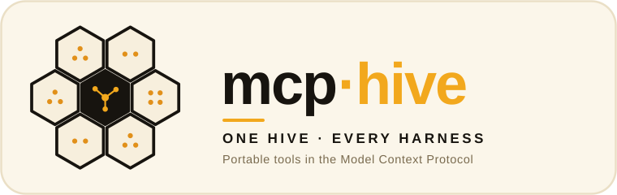

<p align="center">
  
</p>

# mcp-hive

> **Harness-agnostic by design.** Tool/connector definitions written once in the
> open [Model Context Protocol](https://modelcontextprotocol.io) format, merged
> into whatever MCP config each harness reads — Claude Code, Cursor, VS Code /
> GitHub Copilot, Codex, Goose, and more.

*Part of the **[ai-hive](https://github.com/werkrbee/ai-hive)** family — werkrbee's House of Hives (skills · rules · tools · agents · and more).*

The **tools** layer of the House of Hives — where agents actually *act*. Skills
tell an agent what to do and rules tell it how to behave; mcp-hive gives it the
hands. It's a registry of MCP server definitions that installs into every
harness's config, so **Barry** and his fleet share one source of truth for tools.

## Servers

| Server | Description |
|--------|-------------|
| [**filesystem**](servers/filesystem/mcp.json) | Read/write files under a workspace root |
| [**git**](servers/git/mcp.json) | Inspect and operate on a local git repository |
| [**fetch**](servers/fetch/mcp.json) | Fetch and convert web pages to text |

Each server is a small JSON file in the standard MCP shape (`command`, `args`,
`env`). `${WORKSPACE}` is substituted with the target project path at install time.

## Spec version

The registry targets MCP **[2026-07-28](https://modelcontextprotocol.io/specification/2026-07-28)**,
the current revision ([changelog](https://modelcontextprotocol.io/specification/2026-07-28/changelog)).
Every server here is a local stdio launch config, so most of the revision's changes land
in the client and server, not in these files. What each one means for the registry:

**Stateless core.** The `initialize` handshake and protocol-level sessions are gone; every
request carries its own protocol version and client capabilities in `_meta`. A config only
says how to start a server, so it pins no protocol version, and nothing here changes.

**Extensions.** Optional features are now opt-in extensions, negotiated per request through
an `extensions` capability. An entry can work only as far as both the harness's client and
the server support an extension, so a server that needs one should say so in its
`description`.

**Tasks.** Long-running work moved out of the core into the official
`io.modelcontextprotocol/tasks` extension, with polling and durable task handles. The
registry doesn't configure it; the planned workflows-hive will build on it.

**MCP Apps.** The `io.modelcontextprotocol/ui` extension renders interactive UI inline in a
conversation. It's a client capability, so no config change is needed, and servers should still
return plain text for clients without it.

**Auth hardening.** Clients must validate the `iss` parameter (RFC 9207), keep credentials
bound to the issuing authorization server, and prefer Client ID Metadata Documents over the
now-deprecated Dynamic Client Registration. That flow covers HTTP servers only; stdio
servers take credentials from the environment, which is why secrets go in `env`.

## Repository layout

```text
mcp-hive/
├── servers/                      # WHAT tools exist — portable MCP definitions
│   ├── filesystem/mcp.json
│   ├── git/mcp.json
│   └── fetch/mcp.json
├── adapters/                     # WHERE they run — harness taxonomy & overrides
│   ├── claude-code/  cursor/  codex/  gemini-cli/  goose/  opencode/
│   ├── kiro/  databricks-genie-code/  snowflake-cortex-code/
│   └── github-copilot/
│       └── scout/                # sub-harness (child of GitHub Copilot)
├── scripts/
│   └── install.py                # merge servers into each harness's MCP config
├── LICENSE
└── README.md
```

## Install

MCP config formats differ across harnesses (JSON vs TOML vs YAML), so the
installer **merges** into the JSON-based configs and **prints ready-to-paste
snippets** for the rest. Merges are non-destructive — existing servers and other
keys are preserved.

```bash
git clone https://github.com/werkrbee/ai-hive.git
cd ai-hive/hives/mcp-hive

# Merge all servers into the default harnesses for a project
python3 scripts/install.py --dir /path/to/your/project

# Just filesystem + git into Cursor
python3 scripts/install.py --harness cursor --server filesystem --server git --dir /path/to/project

# Preview without writing
python3 scripts/install.py --dry-run

# Codex / Goose print a snippet to paste into their (TOML/YAML) config
python3 scripts/install.py --harness codex --harness goose
```

## MCP config per harness

| Harness | Config file | Servers key |
|---------|-------------|-------------|
| Claude Code | `.mcp.json` (project) / `~/.claude.json` | `mcpServers` |
| Cursor | `.cursor/mcp.json` / `~/.cursor/mcp.json` | `mcpServers` |
| VS Code / GitHub Copilot | `.vscode/mcp.json` | `servers` |
| Codex | `~/.codex/config.toml` | `[mcp_servers.*]` (snippet) |
| Goose | Goose config (YAML) | `extensions` (snippet) |

Paths and keys evolve — confirm against each harness's current docs.

## Adding a server

1. Create `servers/<name>/mcp.json` with `name`, `description`, and a `config`
   block (`command`, `args`, `env`). Use `${WORKSPACE}` for the project path.
2. Update the servers table above.
3. Install it with `python3 scripts/install.py --server <name> ...`.

## Security

MCP servers run with your local permissions and can read files, hit the network,
and execute commands. Only install servers you trust, keep secrets in `env` (never
commit real keys), and review what each server can access.

## License

MIT — see [LICENSE](LICENSE).
