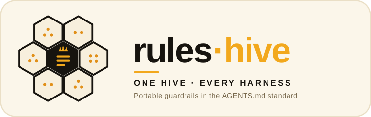

<p align="center">
  
</p>

# rules-hive

> **Harness-agnostic by design.** Guardrails written once as portable
> instruction files, rendered into every agent's native format — `AGENTS.md`,
> `CLAUDE.md`, `.cursor/rules`, `.github/copilot-instructions.md`, `GEMINI.md`,
> and more.

*Part of the **[ai-hive](https://github.com/werkrbee/ai-hive)** family — werkrbee's House of Hives (skills · rules · tools · agents · and more).*

The **instructions** layer of the House of Hives — the domain of **Patricia, the
Queen Bee**. Where [skills-hive](https://github.com/werkrbee/ai-hive/tree/main/hives/skills-hive) holds
*what agents can do* (Barry's realm), rules-hive holds *how they must behave*:
the always-on law every agent inherits, like a queen's pheromones regulating the
colony. Barry, the King Bee, orchestrates the fleet — but always *within*
Patricia's charter. It builds on the open [AGENTS.md](https://agents.md/) standard
and renders the same ruleset into whatever instruction file each harness reads.

## Rulesets

| Ruleset | Description |
|---------|-------------|
| [**queen-charter**](rules/queen-charter/AGENTS.md) | Patricia's operating constitution — human-in-the-loop for consequential actions, 24×7×365 reliability, safety, and delegation (executed under Barry) |
| [**native-platform-product-group-design-consistency**](rules/native-platform-product-group-design-consistency/AGENTS.md) | Patricia's versioned product experience standard across supported platforms, with parity evidence and human-approved exceptions |

For product design reviews, use the [platform parity matrix](rules/native-platform-product-group-design-consistency/references/platform-parity-matrix.md).
Render the product standard with `--ruleset native-platform-product-group-design-consistency`
(PowerShell: `-Ruleset native-platform-product-group-design-consistency`). The
installer replaces its target instruction files; compose the standard with the
Queen's Charter in the product's canonical instructions before installing both.

**The Charter Keeper.** Patricia keeps and enforces the law; how it's maintained,
amended, and enforced is documented in
[`rules/queen-charter/references/charter-keeper.md`](rules/queen-charter/references/charter-keeper.md).
Her enforcement persona is the [`patricia`](https://github.com/werkrbee/ai-hive/tree/main/hives/skills-hive/skills/patricia)
skill in skills-hive — the Queen's counterpart to Barry.

## Approval policy

The Charter says which actions need a human. Its
[`policy.json`](rules/queen-charter/policy.json) says the same thing as data, so a
harness, the workflows-hive engine or a hosted agent can apply it instead of reading
prose. The schema is [`schema/approval-policy.schema.json`](schema/approval-policy.schema.json).

A policy is a list of mandates, shaped after the mandates in
[AP2](https://github.com/google-agentic-commerce/AP2) (v0.2.0), whose authorization model
is written for payments but meant to apply more generally. Each mandate covers one action
and a list of typed constraints that must all hold. The type names follow AP2's, but these
are unsigned policy, not AP2's signed SD-JWT credentials.

- **Open mandate** (`mandate.action.open.1`): the agent may act on its own.
- **Closed mandate** (`mandate.action.1`): bound to one specific action, which a human
  approves first. `present` lists what the approval request must show them.
- **Constraints:** `action.scope` (where it applies, e.g. channel and audience),
  `action.trigger` (the event it responds to) and `action.condition` (a fact that must
  hold, e.g. a member opted in). Values compare strictly, so `1` is not `true`.

Actions come from the permission vocabulary in agents-hive's execution-contract schema,
so a contract and a policy speak the same language: a contract says what a worker may do
at all, and the policy says when it may do it without asking. A product policy can
`extends` the Charter's and declare its own namespaced actions, such as
`lineup.event.cancel`.

A request is decided in this order. A matching **prohibition** denies it, even with a
human's approval. Otherwise a matching open mandate lets the agent act, and otherwise a
matching closed mandate sends it to a human, showing the `present` items of every closed
mandate that matched. Anything else is denied. A fact the request leaves out never
satisfies a mandate, and never gets a request out from under a prohibition. A policy's
own entries are checked before those of the policy it extends, and it can't redeclare an
action that policy already declares.

The Charter's policy has open mandates for the five local, reversible permissions and
closed mandates for the ten gated ones. An open mandate for a gated action is an
exception, so it must be narrow (a scope plus a trigger or condition) and must record
why and where it was decided.

[`examples/lineup-etiquette/`](examples/lineup-etiquette/policy.json) is a worked
example taken from [lineup's house rules](https://github.com/werkrbee/lineup/blob/main/rules/lineup-etiquette/AGENTS.md).
Messages go only to members who opted in, on every channel, and that holds even with
approval. Organizer blasts, cancellations, removals and group deletes need the organizer's
approval, and only organizers may make them.
The bullpen open-slot call, a carve-out that used to live in prose, is an open mandate
scoped to the bullpen, triggered by `bullpen.slot-opened`, and limited to members who
opted in.

`scripts/check_policy.py` checks each policy against the schema and the vocabulary, then
runs the `cases.json` beside it: each case is a request and the decision the policy must
reach, optionally with the rule that must decide it and what the approval must present.
CI runs it. Policies are declarations today: nothing enforces them at runtime yet.

## Repository layout

```text
rules-hive/
├── rules/                        # WHAT the guardrails say — portable source of truth
│   └── queen-charter/
│       ├── AGENTS.md             # the canonical ruleset (open standard)
│       ├── policy.json           # its approval rules as data
│       ├── cases.json            # decisions the policy must reach
│       └── references/
├── schema/
│   └── approval-policy.schema.json
├── examples/
│   └── lineup-etiquette/         # a product policy that extends the Charter's
├── adapters/                     # WHERE they apply — harness taxonomy & overrides
│   ├── claude-code/  cursor/  codex/  gemini-cli/  goose/  opencode/
│   ├── kiro/  databricks-genie-code/  snowflake-cortex-code/
│   └── github-copilot/
│       └── scout/                # sub-harness (child of GitHub Copilot)
├── scripts/
│   ├── install.sh                # render a ruleset into per-harness instruction files
│   ├── install.ps1               # Windows equivalent
│   └── check_policy.py           # check approval policies and their cases
├── LICENSE
└── README.md
```

Same two-axis model as skills-hive: `rules/` is the portable content; `adapters/`
is the harness taxonomy (Scout nests under GitHub Copilot).

## Install

Instructions are usually **project-scoped**, so the installer writes into the
current directory by default. It renders the ruleset into each harness's native
filename (adding Cursor `.mdc` frontmatter automatically).

```bash
git clone https://github.com/werkrbee/ai-hive.git
cd ai-hive/hives/rules-hive
chmod +x scripts/install.sh

# Into the current project, default harnesses (AGENTS.md, CLAUDE.md, Cursor, Copilot, Gemini)
./scripts/install.sh --dir /path/to/your/project

# Just AGENTS.md + Claude Code
./scripts/install.sh --harness agents --harness claude-code --dir /path/to/project

# User-level (where supported: Claude Code, Codex)
./scripts/install.sh --global --harness claude-code
```

On Windows: `.\scripts\install.ps1 -Dir C:\path\to\project`.

## Instruction files per harness

| Harness | Instruction file (project) |
|---------|----------------------------|
| AGENTS.md standard (Codex, opencode, Kiro, Amp, Jules, …) | `AGENTS.md` |
| Claude Code | `CLAUDE.md` (or `~/.claude/CLAUDE.md`) |
| Cursor | `.cursor/rules/<ruleset>.mdc` |
| GitHub Copilot | `.github/copilot-instructions.md` |
| Gemini CLI | `GEMINI.md` |
| Goose | `.goosehints` |

Filenames evolve — confirm against each harness's current docs. When in doubt,
`AGENTS.md` is the widest-supported shared standard.

## Adding a ruleset

1. Create `rules/<name>/AGENTS.md` (plain Markdown; keep it portable and harness-neutral).
2. Add optional `references/`.
3. Update the rulesets table above.
4. Render it with `./scripts/install.sh --ruleset <name> ...`.

## License

MIT — see [LICENSE](LICENSE).
