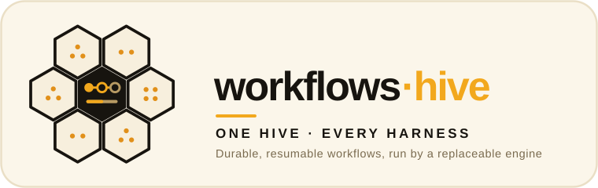

<p align="center">
  
</p>

# workflows-hive

> **Durable, resumable workflows.** Multi-step recipes written once as portable plans,
> run by a replaceable engine, and exposed to every harness through MCP Tasks.

*Part of the **[ai-hive](https://github.com/werkrbee/ai-hive)** family — werkrbee's House of Hives (skills · rules · tools · agents · and more).*

The **orchestration** layer of the House of Hives. Barry decomposes and coordinates work
at runtime; workflows-hive is the saved version of that work. A workflow is a plan of
steps that checkpoints as it runs, so it can survive a restart, pause for approval, and
report its result and its cost when it finishes.

[`DESIGN.md`](DESIGN.md) records the contract: MCP Tasks as the interface, the engine
decision (Temporal evaluated), and the shape of the persisted plan and checkpoint. The
reference engine, `scripts/run.py`, runs plans against it. The MCP Tasks server comes
later.

## Workflows

| Workflow | What it does |
|----------|--------------|
| [**word-count**](workflows/word-count/workflow.json) | Read a text file, then count its words and lines (the resumable spike) |

## Repository layout

```text
workflows-hive/
├── workflows/                    # WHAT workflows exist — portable plans
│   └── word-count/workflow.json
├── adapters/                     # WHERE they run — harness taxonomy & overrides
│   ├── claude-code/  cursor/  codex/  gemini-cli/  goose/  opencode/
│   ├── kiro/  databricks-genie-code/  snowflake-cortex-code/
│   └── github-copilot/
│       └── scout/                # sub-harness (child of GitHub Copilot)
├── scripts/
│   └── run.py                    # reference engine: run, checkpoint, resume
├── DESIGN.md                     # the workflow contract and engine decision
├── LICENSE
└── README.md
```

A workflow reaches a harness as an MCP server, so most harnesses need nothing beyond
their usual MCP config. The `adapters/` tree holds per-harness wiring if a harness ever
needs it, the same taxonomy every other hive uses.

## Run a workflow

The reference engine needs Python 3 and nothing else. It writes one run record per run to
`~/.local/state/workflows-hive/runs` (change it with `--state-dir`), after every step.

```bash
git clone https://github.com/werkrbee/ai-hive.git
cd ai-hive/hives/workflows-hive

# Run both steps
python3 scripts/run.py start word-count --input path=README.md

# Stop the process right after step 1 checkpoints, then pick the run back up
python3 scripts/run.py start word-count --input path=README.md --crash-after read
python3 scripts/run.py resume <run-id>     # skips step 1, runs step 2

python3 scripts/run.py status <run-id>
```

`--crash-after` exits right after a step's checkpoint is written, to stand in for a
crash or a deploy. A process killed in the middle of a step resumes by running that step
again with the same idempotency key. Every run ends by printing its result and its
cost. The demo workers don't call a model, so they meter an estimated token count at a
simulated price. Approvals and budgets are part of the contract but not yet supported
by the engine, so it rejects plans that use them.

## License

MIT — see [LICENSE](LICENSE).
